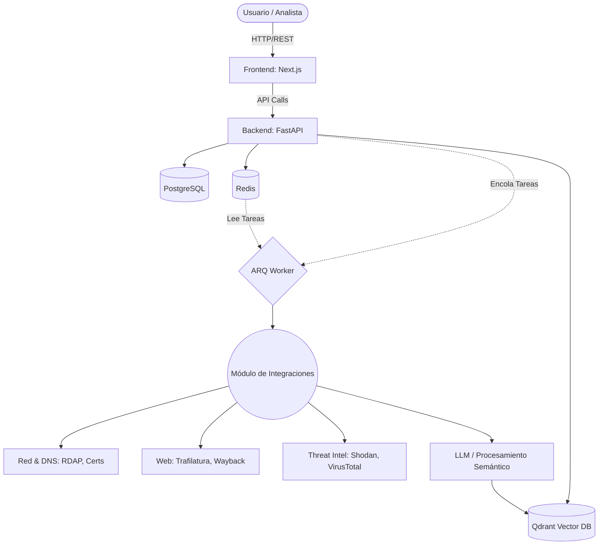
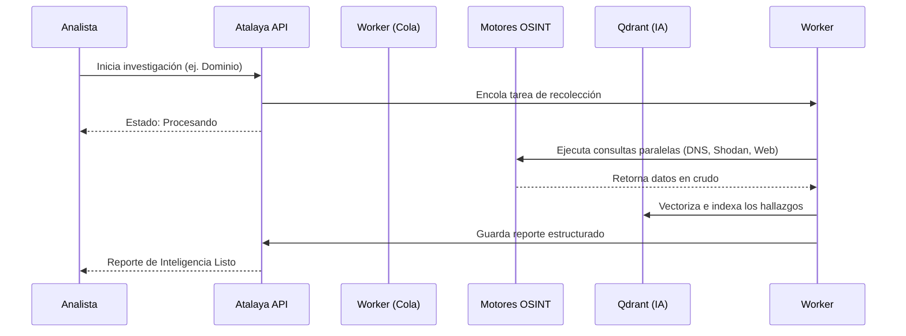

<div align="center">
  <h1>👁️ Atalaya OSINT AI Platform</h1>
  <p><i>Un arnés avanzado y modular para Inteligencia Artificial en investigaciones de Fuentes Abiertas (OSINT).</i></p>

  [](https://python.org)
  [](https://nextjs.org/)
  [](https://fastapi.tiangolo.com/)
  [](https://postgresql.org)
  [](https://docker.com)
</div>

---

## 📌 Mi Opinión Profesional sobre el Proyecto

Tras analizar el repositorio, **Atalaya OSINT** destaca como una plataforma robusta y excepcionalmente bien estructurada. 
* **Arquitectura Escalable:** El uso de **FastAPI** junto con **ARQ (Redis)** para la gestión asíncrona de tareas pesadas de investigación garantiza que la plataforma pueda manejar un gran volumen de datos sin bloquearse.
* **Integración Nativa de IA:** La inclusión de **Qdrant** (base de datos vectorial) nativamente en el `docker-compose` evidencia un diseño pensado desde cero para el análisis semántico y la Inteligencia Artificial (RAG - Retrieval-Augmented Generation).
* **Modularidad de OSINT:** El archivo `catalog.yaml` presenta un diseño elegante para separar integraciones nativas de aquellas que requieren claves API (Shodan, VirusTotal, etc.), lo que permite que el sistema sea útil incluso en su versión gratuita.
* **Developer Experience (DX):** El uso extensivo de un `Makefile` muy completo permite levantar toda la infraestructura compleja con un simple comando.

En resumen, es un arnés de IA para OSINT con un nivel empresarial, listo para producción y altamente extensible.

---

## 🗺️ Arquitectura del Sistema

La arquitectura de Atalaya se divide en microservicios interconectados, garantizando alta disponibilidad y separación de responsabilidades.



---

## 🔄 Flujo de Investigación (Pipeline)



---

## 🚀 Instalación y Configuración

El proyecto está diseñado para ser desplegado fácilmente utilizando Docker y un entorno Makefile automatizado.

### 📋 Requisitos Previos

* Docker y Docker Compose (v2)
* Python 3.11+ (para desarrollo local)
* Node.js 18+ y npm (para desarrollo frontend)
* Make (preinstalado en Linux/macOS)

### 🛠️ Paso 1: Clonar el Repositorio

```bash
git clone https://github.com/tu-usuario/atalaya-osint.git
cd atalaya-osint
```

### ⚙️ Paso 2: Configuración del Entorno

Copie el archivo de ejemplo para configurar las variables de entorno. Aquí podrá agregar las claves API de los servicios opcionales si dispone de ellas.

```bash
cp .env.example .env
```

Edite el archivo `.env` según sus necesidades. Las integraciones "builtin" (como Búsqueda Web, DNS, Extracción de Documentos) funcionarán sin configuración adicional.
Para integraciones avanzadas (Shodan, VirusTotal, Hunter.io), añada sus APIs en las variables correspondientes.

Puede generar claves seguras para la aplicación ejecutando:
```bash
make generate-keys
```

### 🐳 Paso 3: Despliegue con Docker (Recomendado)

Para levantar todos los servicios (Base de datos, Frontend, Backend, Redis, Worker, Qdrant):

```bash
make docker-up
```

*El sistema tardará unos momentos en descargar las imágenes de Postgres, Redis y Qdrant la primera vez.*

### 💾 Paso 4: Inicializar la Base de Datos

Una vez que los contenedores estén corriendo, ejecute las migraciones de la base de datos y cargue los datos semilla (usuario administrador por defecto):

```bash
make migrate
make seed
```

---

## 🖥️ Uso y Acceso

Una vez instalado, Atalaya OSINT expone los siguientes servicios:

* **Panel Frontend (Next.js):** [http://localhost:3000](http://localhost:3000)
  * Interfaz de usuario para lanzar y visualizar investigaciones.
* **API Backend (FastAPI):** [http://localhost:8000](http://localhost:8000)
  * Punto de acceso principal para interactuar programáticamente con el sistema.
* **Documentación Interactiva de la API (Swagger UI):** [http://localhost:8000/docs](http://localhost:8000/docs)
  * Explora todos los endpoints disponibles y pruébalos directamente desde el navegador.

### Gestión de Servicios (Comandos Make útiles)

Atalaya incluye comandos útiles para administrar el ciclo de vida de la aplicación:

* `make docker-down`: Apaga todos los contenedores.
* `make docker-logs`: Muestra en tiempo real los registros (logs) de todos los microservicios.
* `make reset-db`: **Precaución:** Elimina y recrea la base de datos desde cero.
* `make dev`: Levanta el entorno en modo desarrollo nativo (sin dockerizar backend/frontend).

---

## 🧩 Integraciones Disponibles

El catálogo de Atalaya se divide en dos niveles de integración:

### 🟢 Nativas (No requieren API Key)
* **Red:** DNS Resolver, RDAP / WHOIS, Geolocalización IP.
* **Certificados:** Certificate Transparency (crt.sh).
* **Web:** Web Fetch (extracción de texto), Búsqueda Web (DuckDuckGo), Wayback Machine.
* **Social / Archivos:** Perfiles públicos de GitHub y Reddit, Extractor de metadatos de documentos e imágenes.

### 🔵 Premium / Opcionales (Requieren API Key en el `.env`)
* **Inteligencia de Amenazas:** Shodan, VirusTotal, URLScan.io, Censys, SecurityTrails.
* **OSINT Avanzado:** Hunter.io (Emails), Have I Been Pwned (Brechas), IPinfo (Geolocalización avanzada).

---
<div align="center">
  <i>Desarrollado para potenciar investigaciones OSINT con Inteligencia Artificial.</i>
</div>
