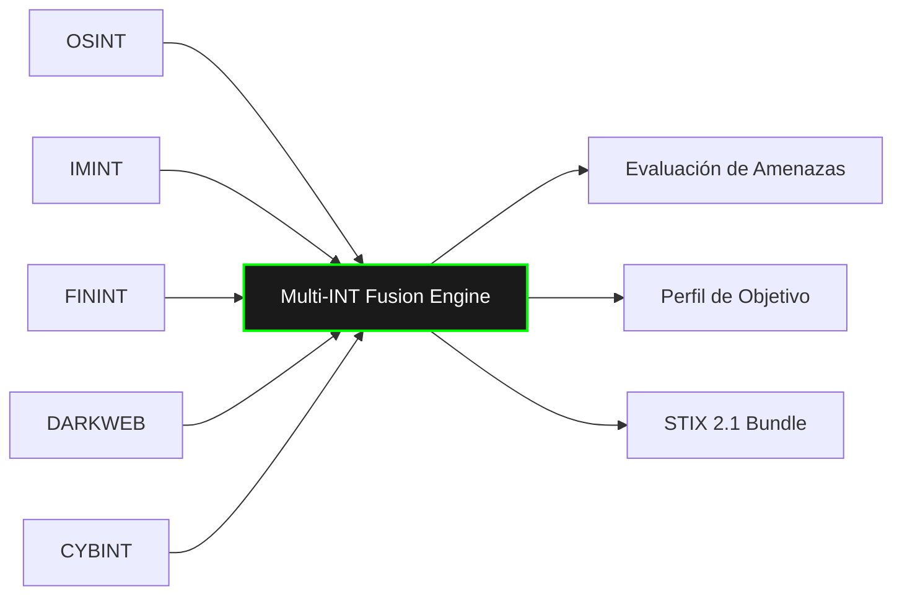
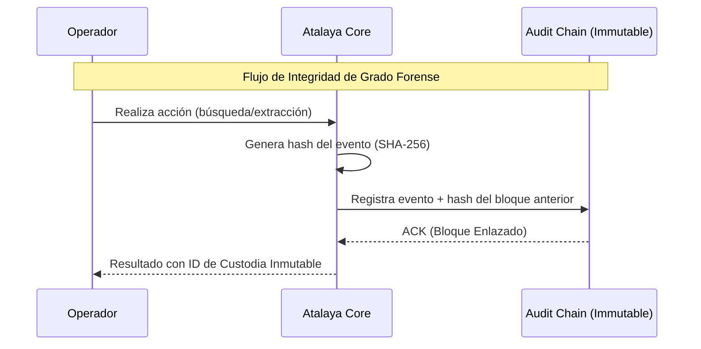

<div align="center">
  
  <h1>👁️ ATALAYA OSINT AI PLATFORM v2.0</h1>
  <p><b>CENTRO DE MANDO Y CONTROL DE INTELIGENCIA MULTI-DISCIPLINA</b></p>
  <p><i>State-grade intelligence collection, multi-INT fusion, and automated reporting system</i></p>

  [](https://python.org)
  [](https://nextjs.org/)
  [](https://github.com/murdok1982/Atalaya-OSINT-AI-Platform)
  [](https://github.com/murdok1982/Atalaya-OSINT-AI-Platform)
</div>

---

## 🎖️ VISIÓN ESTRATÉGICA

**ATALAYA** ha evolucionado de una herramienta de recolección de datos a una plataforma de **Inteligencia de Grado Estatal**. Diseñada para analistas de inteligencia, operativos de ciberseguridad y unidades de defensa, Atalaya v2.0 proporciona una visión holística de amenazas mediante la fusión de múltiples disciplinas de inteligencia en tiempo real.

> [!IMPORTANT]
> **DOCUMENTACIÓN CLASIFICADA:** El acceso a esta plataforma requiere niveles de autorización adecuados. Toda actividad es registrada en una cadena de custodia inmutable mediante *Hash Chaining*.

---

## 📊 CAPACIDADES TÁCTICAS (Multi-INT)

Atalaya integra 8 disciplinas de inteligencia bajo un único motor de fusión correlacional:

| Disciplina | Descripción | Estado |
|:---|:---|:---:|
| **OSINT** | Inteligencia de fuentes abiertas: DNS, IP, Dominios, Infraestructura. | ✅ OPERATIVO |
| **SOCMINT** | Inteligencia de Redes Sociales: Análisis de grafos de influencia y perfiles. | ✅ OPERATIVO |
| **GEOINT** | Inteligencia Geoespacial: Análisis satelital y mapas tácticos dinámicos. | ✅ OPERATIVO |
| **IMINT** | Inteligencia de Imágenes: EXIF profundo, OCR, análisis de manipulación. | ✅ OPERATIVO |
| **FININT** | Inteligencia Financiera: Rastreo de cripto-activos y detección de AML. | ✅ OPERATIVO |
| **CYBINT** | Inteligencia de Ciberamenazas: Mapeo MITRE ATT&CK e IoCs. | ✅ OPERATIVO |
| **DARKWEB** | Monitoreo de Dark Web: Breach databases y paste sites. | ✅ OPERATIVO |
| **MULTI-INT FUSION** | Correlación cruzada inteligente de todas las fuentes anteriores. | ✅ OPERATIVO |

---

## 🏗️ ARQUITECTURA DE MISIÓN (Event-Driven)

La plataforma utiliza una arquitectura orientada a eventos para garantizar el procesamiento masivo y la integridad de los datos.

### Motor de Fusión Inteligente


### Cadena de Custodia e Integridad (Audit Chain)


---

## 🛡️ SEGURIDAD Y GOBERNANZA

Implementación de protocolos de seguridad militar para la protección de activos de inteligencia:

*   **Protección Anti-Brute Force:** Lockout progresivo a nivel de cuenta e IP.
*   **Gestión de Sesiones:** Revocación de tokens vía JTI con Redis-backend.
*   **Niveles de Clasificación:** Etiquetas de seguridad `TOP_SECRET`, `SECRET`, `CONFIDENTIAL`.
*   **WAF Integrado:** Headers de seguridad estrictos (CSP, HSTS, Permissions-Policy).
*   **STIX/TAXII 2.1:** Intercambio estandarizado de inteligencia de amenazas.
*   **WebSocket Real-Time:** Alertas de amenazas y actualizaciones de trabajos en vivo.

---

## 🚀 DESPLIEGUE OPERATIVO

### Inicio Rápido
```bash
# Clonar repositorio
git clone https://github.com/murdok1982/Atalaya-OSINT-AI-Platform
cd Atalaya-OSINT-AI-Platform

# Preparar entorno
cp .env.example .env
make generate-keys

# Lanzar Stack Completo (Kafka, Neo4j, Redis, PG, Monitoring)
make docker-full
```

### Servicios Disponibles
*   **Command Center (Frontend):** `http://localhost:3000`
*   **Intelligence API:** `http://localhost:8000/docs`
*   **Observability (Grafana):** `http://localhost:3001`
*   **Traffic Monitor (Prometheus):** `http://localhost:9091`

---

## 🛠️ OBSERVABILIDAD Y MÉTRICAS

Atalaya monitoriza cada operación mediante un stack completo de observabilidad:
*   **Métricas de API:** Latencia, Tasa de errores, Rendimiento de Endpoints.
*   **Estado del Worker:** Tasa de éxito de jobs, tiempos de procesamiento INT.
*   **Seguridad:** Intentos de login fallidos, bloqueos de IP en tiempo real.

---

## 🤝 DONACIONES (SUPPORT THE MISSION)

Si este proyecto te ha sido útil y deseas apoyar su desarrollo continuo para mantenerlo en la vanguardia de la tecnología OSINT, puedes realizar una donación de forma segura:

┏━━━━━━━━━━━━━━━━━━━━━━━━━━━━━━━━━━━┓
┃  ₿  Bitcoin Donation Address  ₿   ┃
┣━━━━━━━━━━━━━━━━━━━━━━━━━━━━━━━━━━━┫
┃                                   ┃
┃   bc1qqphwht25vjzlptwzjyjt3sex    ┃
┃   7e3p8twn390fkw                  ┃
┃                                   ┃
┗━━━━━━━━━━━━━━━━━━━━━━━━━━━━━━━━━━━┛

---

## 📜 LICENCIA Y TÉRMINOS
Este software se entrega "tal cual" bajo licencia MIT. El uso de esta herramienta para actividades ilegales es responsabilidad exclusiva del usuario. Atalaya está diseñado para fines de investigación, defensa y análisis legítimo.

<div align="center">
  <p><b>ATALAYA v2.0 - DEFENSE BY INTELLIGENCE</b></p>
  <p>© 2024 Murdok & Atalaya OSINT Community</p>
</div>

---

## 🎖️ CENTRO DE COMUNICACIONES Y REPORTES OFICIALES
**NIVEL DE ACCESO:** AUTORIZADO | **DESTINATARIO:** COMANDANCIA DE DESARROLLO (gustavolobatoclara@gmail.com)

A través del siguiente portal de comunicaciones, el personal autorizado puede emitir reportes de incidencias, fallas críticas en despliegue (compilación) o solicitudes de mejoras estratégicas. Seleccione la directiva correspondiente para visualizar los protocolos de envío:

<details>
<summary><b>🚨 REPORTAR QUEJA O INCIDENCIA DISCIPLINARIA / OPERATIVA</b></summary>
<br>
Para tramitar una queja sobre el funcionamiento, estructura o contenido del sistema, envíe un mensaje a <b>gustavolobatoclara@gmail.com</b> siguiendo este protocolo:
<ol>
  <li><b>Asunto:</b> [QUEJA] - Nombre del Sistema - Breve descripción.</li>
  <li><b>Cuerpo del mensaje:</b> Detallar claramente la incidencia, impacto operativo y, si es posible, la evidencia (capturas o logs).</li>
  <li><b>Prioridad:</b> Indicar si es de atención inmediata o diferida.</li>
</ol>
</details>

<details>
<summary><b>🛠️ REPORTE DE PROBLEMAS DE COMPILACIÓN O DESPLIEGUE</b></summary>
<br>
Si experimenta fallos durante la fase de compilación o instalación del sistema, reporte a <b>gustavolobatoclara@gmail.com</b> con la siguiente estructura técnica:
<ol>
  <li><b>Asunto:</b> [COMPILACIÓN] - Falla en entorno &lt;Entorno/OS&gt;.</li>
  <li><b>Especificaciones:</b> Sistema Operativo, versión de dependencias y herramientas de compilación utilizadas.</li>
  <li><b>Traza de Error (Logs):</b> Adjunte el log completo de errores proporcionado por la terminal (en formato texto o captura legible).</li>
  <li><b>Pasos de Reproducción:</b> Secuencia exacta de comandos ejecutados antes del fallo crítico.</li>
</ol>
</details>

<details>
<summary><b>💡 SUGERENCIAS O SOLICITUDES DE DESARROLLO</b></summary>
<br>
Para proponer nuevas capacidades tácticas, módulos de inteligencia o mejoras de arquitectura, envíe su solicitud a <b>gustavolobatoclara@gmail.com</b>:
<ol>
  <li><b>Asunto:</b> [PROPUESTA] - Mejora o Nuevo Módulo.</li>
  <li><b>Objetivo Táctico:</b> ¿Qué problema resuelve o qué ventaja proporciona esta nueva característica?</li>
  <li><b>Viabilidad:</b> (Opcional) Posible enfoque técnico o herramientas recomendadas para su implementación.</li>
</ol>
</details>

---
